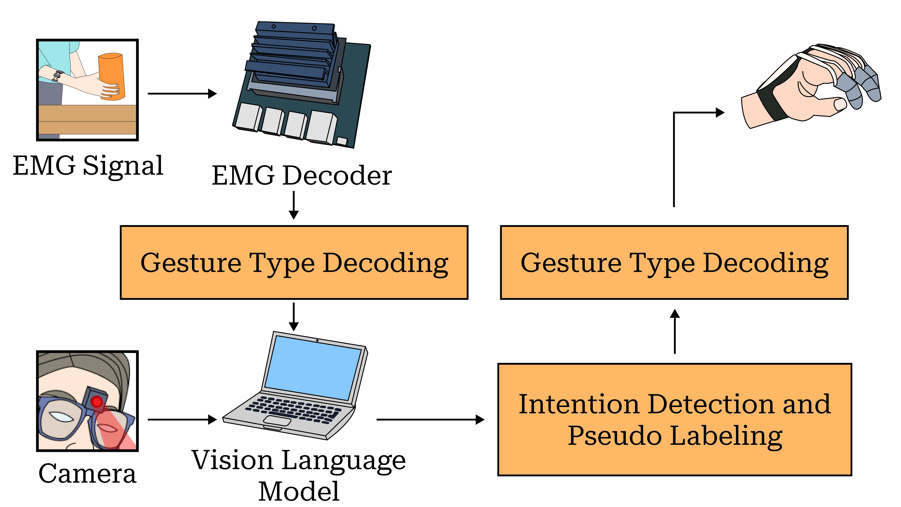

# Light-Weight Vision Language Model Guided Gesture Recognition Based on Electromyography

### VLM for Gesture Classification

## Overview

<p align="center">
    
</p>


>**Abstract**: <br>
> Active rehabilitation of the upper limbs requires the decoding of user intentions from biosensors, particularly electromyography (EMG), to deliver augmented support during activities of daily living (ADL). Traditional methods typically depend on supervised, subject-specific training to reduce accuracy degradation caused by anatomical and environmental variations. However, these approaches often neglect the context in which gestures are intended. To bridge this gap, we propose a novel gesture decoding pipeline that integrates vision understanding to provide contextual information, thereby enhancing the control of objects during gesture inference. Our decoding pipeline is optimized for edge deployment and is evaluated for its ability to infer gestures with high classification accuracy and reliability.

## Citation
If you make use of our work, please cite our paper:


```bibtex
This paper is currently under consideration. 
```


## Result Presented in the Paper

'''
1. The FAN model pre-trained on 33 participants can be found in [here]([https://docs.conda.io/projects/conda/en/latest/user-guide/install/linux.html](https://github.com/deremustapha/VLM-EMG4Gesture/tree/master/code_result)).
'''
